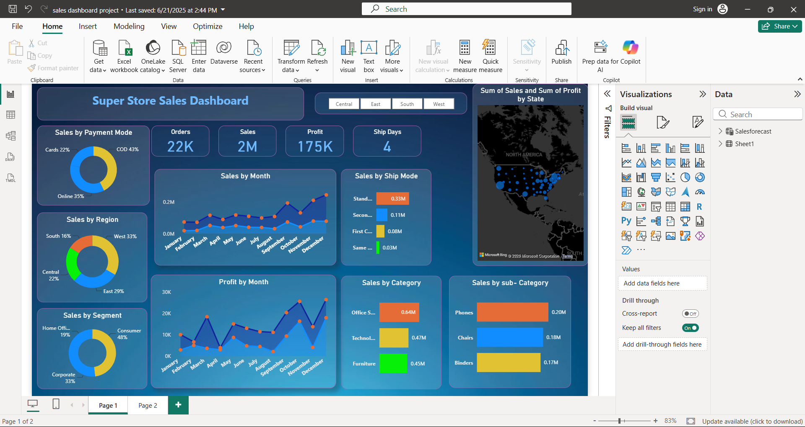
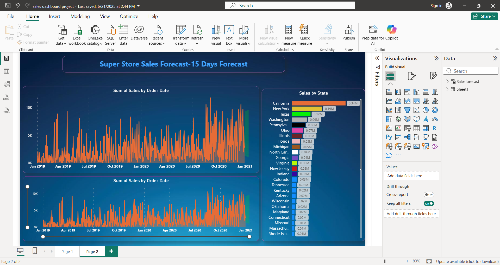

# Super Store Sales Dashboard - Power BI

## Project Overview

This project is an interactive Power BI dashboard developed to analyze Super Store sales data and generate meaningful business insights.

The dashboard provides a detailed view of sales, profit, quantity, shipping performance, customer segments, payment modes, product categories, regions, and state-wise performance.

## Dataset

The dataset contains **5,901 sales records** covering the period from **January 2019 to December 2020**.

### Key Data Fields

- Order Date
- Ship Date
- Ship Mode
- Customer
- Segment
- State
- Region
- Category
- Sub-Category
- Product
- Sales
- Quantity
- Profit
- Payment Mode

## Tools & Technologies

- Power BI
- Power Query
- DAX
- Microsoft Excel

## Data Preparation

The dataset was prepared and transformed using Power Query.

The main data preparation steps included:

- Data cleaning
- Data type correction
- Handling and reviewing missing values
- Date transformation
- Data transformation
- Creating calculated fields and measures
- Preparing data for visualization and analysis

## Key KPIs

| KPI | Value |
|---|---:|
| Total Sales | $1.56M |
| Total Profit | $175.26K |
| Total Quantity | 22.32K |
| Unique Orders | 3,003 |
| Average Shipping Time | 3.93 Days |

## Dashboard Analysis

### 1. Sales Performance

The dashboard analyzes sales performance using:

- Monthly Sales
- Monthly Profit
- Sales by Region
- Sales by Category
- Sales by Sub-Category
- Sales by State

### 2. Customer Segment Analysis

Sales are analyzed across three customer segments:

- Consumer
- Corporate
- Home Office

Consumer is the largest segment, contributing approximately **48%** of sales.

### 3. Regional Analysis

The dashboard compares sales across four regions:

- West
- East
- Central
- South

The West region contributes approximately **33%** of total sales.

### 4. Payment Mode Analysis

Sales are analyzed by payment mode:

- COD
- Online
- Cards

COD contributes approximately **43%**, followed by Online at **35%** and Cards at **22%**.

### 5. Category Analysis

The dashboard analyzes three major product categories:

- Office Supplies
- Technology
- Furniture

Office Supplies contributes the highest sales among the three categories.

### 6. Sub-Category Analysis

The dashboard identifies top-performing sub-categories.

Some of the leading sub-categories include:

- Phones
- Chairs
- Binders

### 7. State-wise Analysis

The dashboard provides state-level sales analysis.

Top-performing states include:

- California
- New York
- Texas
- Washington

## Sales Forecast

A separate dashboard page was created for sales forecasting.

The forecast page includes:

- Historical sales trend
- Sales trend over time
- State-wise sales comparison
- 15-day sales forecast

This helps provide a forward-looking view of potential sales performance.

## Dashboard Preview

### Main Sales Dashboard

### Sales Forecast Dashboard

## Key Insights

- Total sales generated were approximately **$1.56M**.
- Total profit was approximately **$175.26K**.
- The West region generated the highest share of sales.
- Consumer customers contributed the largest share of sales.
- Office Supplies was the highest-selling category.
- Phones, Chairs, and Binders were among the leading sub-categories.
- COD was the most commonly used payment mode.
- The average shipping time was approximately **4 days**.
- California was the highest-selling state.
- A separate forecast page was developed to analyze future sales trends.

## Skills Demonstrated

- Data Cleaning
- Data Transformation
- Data Analysis
- Power Query
- DAX
- KPI Development
- Data Visualization
- Business Intelligence
- Dashboard Development
- Sales Analysis
- Forecasting

## Project Files

- `sales dashboard project.pbix` - Power BI project file
- `Dashboard.png` - Main sales dashboard
- `Dashboard2.png` - Sales forecast dashboard

## Conclusion

This project demonstrates how Power BI can be used to transform raw sales data into an interactive business intelligence dashboard.

The dashboard combines KPI tracking, sales analysis, customer segmentation, regional analysis, product analysis, shipping performance, and sales forecasting to support data-driven business decision-making.
